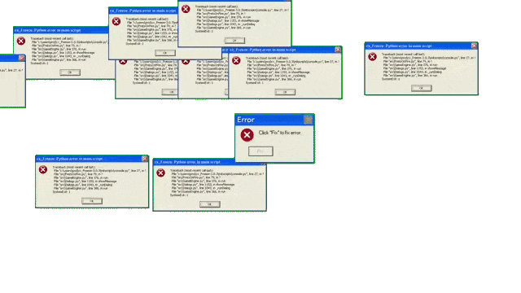

<!-- 🚀 Profile Banner -->

  

 

  

 

<!--  -->

<!-- 

𝙻𝚘𝚊𝚍𝚒𝚗𝚐 𝚌𝚞𝚛𝚒𝚘𝚜𝚒𝚝𝚢.𝚎𝚡𝚎 𝚠𝚒𝚝𝚑 𝚎𝚗𝚍𝚕𝚎𝚜𝚜 𝚕𝚒𝚗𝚎𝚜 𝚘𝚏 𝚌𝚘𝚍𝚎. 
𝚃𝚛𝚊𝚒𝚗𝚒𝚗𝚐 𝚊𝚕𝚐𝚘𝚛𝚒𝚝𝚑𝚖𝚜 𝚠𝚑𝚒𝚕𝚎 𝚌𝚘𝚕𝚕𝚎𝚌𝚝𝚒𝚗𝚐 𝚞𝚗𝚎𝚡𝚙𝚎𝚌𝚝𝚎𝚍 𝚋𝚞𝚐𝚜. 
𝙳𝚎𝚋𝚞𝚐𝚐𝚒𝚗𝚐 𝚙𝚛𝚘𝚓𝚎𝚌𝚝𝚜 𝚊𝚗𝚍 𝚘𝚌𝚌𝚊𝚜𝚒𝚘𝚗𝚊𝚕𝚕𝚢 𝚝𝚑𝚎 𝚍𝚎𝚟𝚎𝚕𝚘𝚙𝚎𝚛. 

 -->

